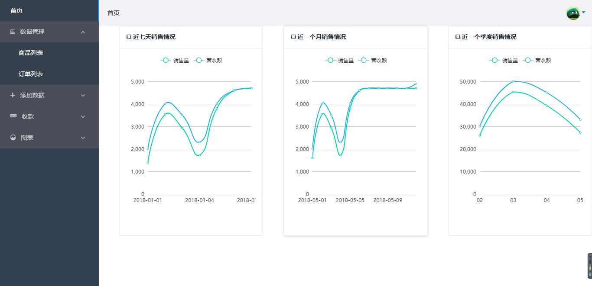
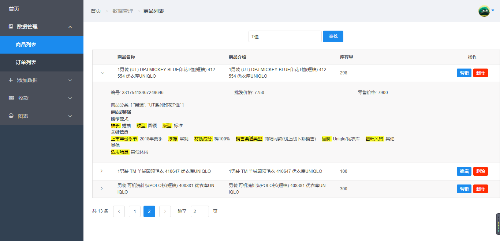
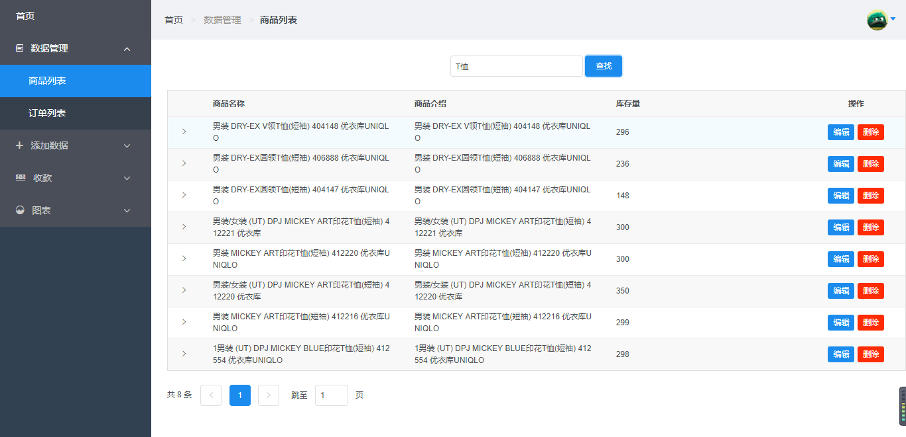
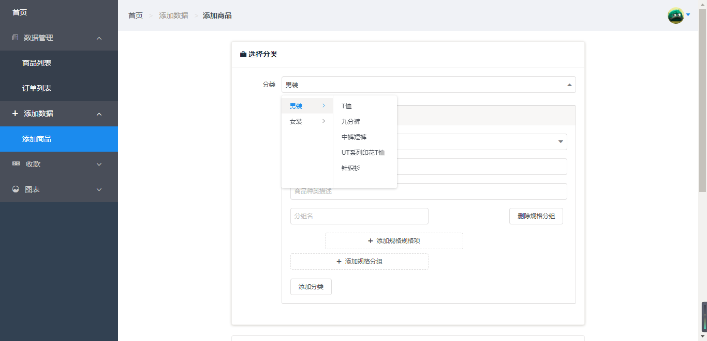
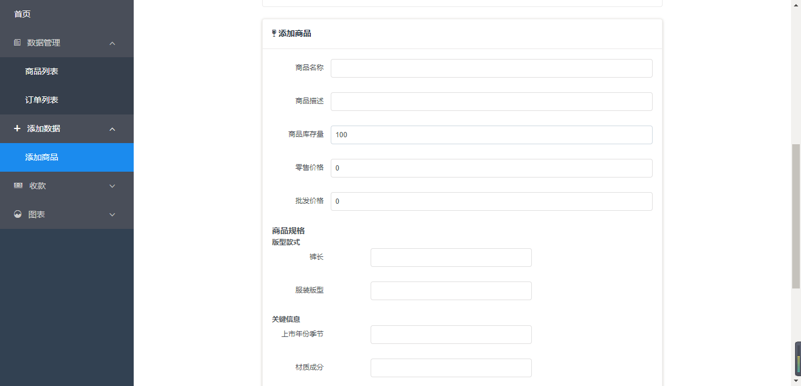
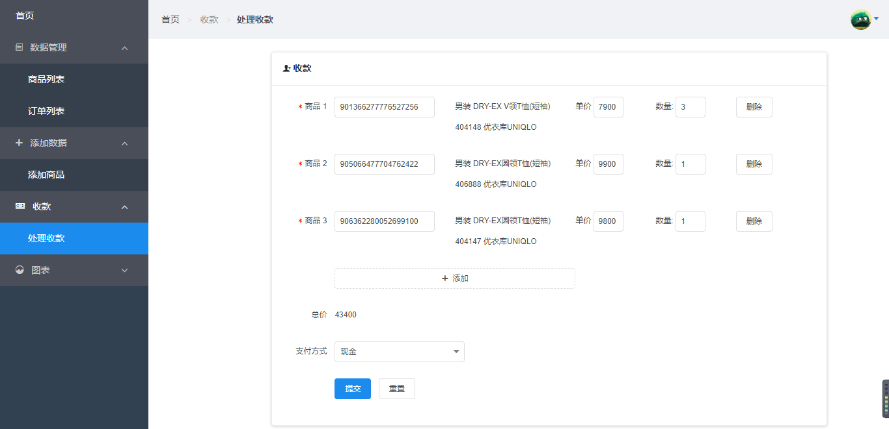
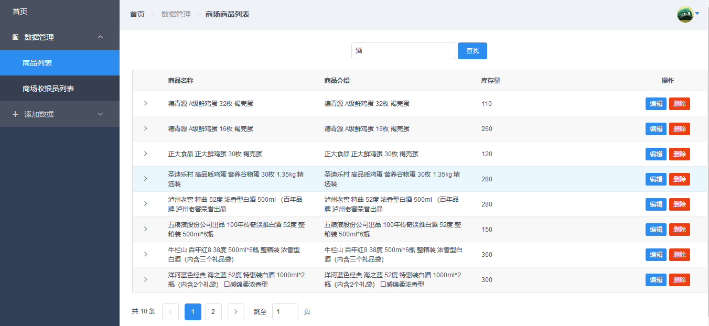
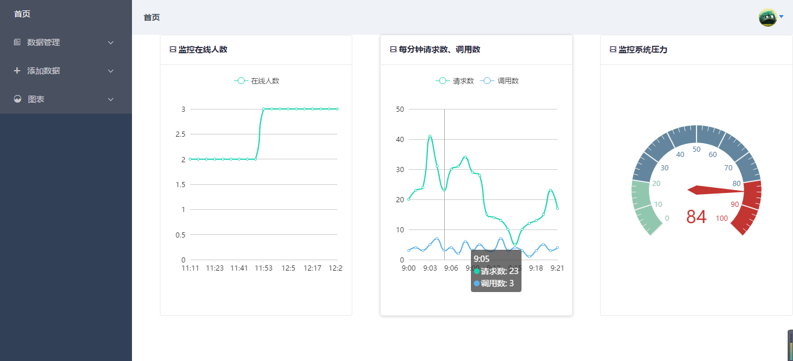
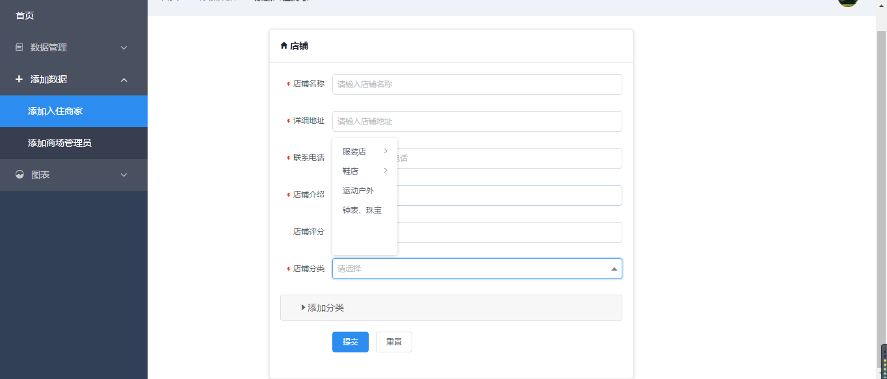

# 商场管理系统

技术栈：Vue.js + vue-router + iView + axios + v-charts

  本项目是基于一个虚拟的华贸商场管理系统，该系统可以对用户、商品信息进行管理。系统用户分为系统管理员、商场管理员、商场收银员、入驻商家，每类用户利用该系统完成各自的职责需求。每类用户只能访问各自的操作页面，不能访问其他类用户的模块；系统需要登录才能进一步操作。

> 使用Spring MVC、Vue.js和非关系型数据库MongoDB，应用RESTful架构风格构建系统。系统采用前后端分离独立开发，前端使用Vue.js和基于Vue.js的UI 组件库iView构建前端界面，后端使用Spring MVC发布http服务，前后端交互采用JSON格式数据进行交互，使用axios来跟服务器交互，使用基于 Vue2.0 和 echarts 封装的 v-charts 图表组件来图形化展示数据。使用Spring Data MongoDB操作MongoDB，简化了对数据库操作。

## Build Setup

``` bash
# install dependencies
npm install

# serve with hot reload at localhost:8080
npm run dev

# build for production with minification
npm run build

# build for production and view the bundle analyzer report
npm run build --report

# run unit tests
npm run unit

# run e2e tests
npm run e2e

# run all tests
npm test
```

For a detailed explanation on how things work, check out the [guide](http://vuejs-templates.github.io/webpack/) and [docs for vue-loader](http://vuejs.github.io/vue-loader).

## 部分截图




















## 使用

配合后端项目使用

# License

[PGL]: LICENCE.txt

